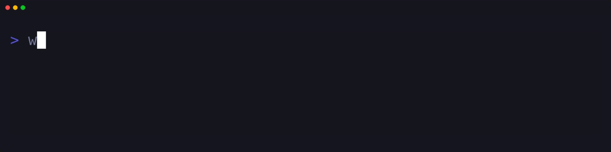

<div id="header" align="center">
  
</div>

---

### 󱩊 `whoami.py`

```python
class z3r0:
  def __init__(self):
    self.roles = ["student"]
    self.systems = ["cachyOS (Arch-btw)", "macOS", "Kali Linux"]
    self.focus_areas = ["cybersecurity", "privacy", "pentesting"]

  def execute_daily_routine(self):
    while True:
      self.dodge_distractions()
      self.study_in_blocks()
      self.rice_desktop()
```

### `tech_stack.sh`

<div align="center">
  
</div>

### `github_stats.json`

<div align="center">
  <a href="https://git.io/streak-stats">
    
  </a>
</div>
